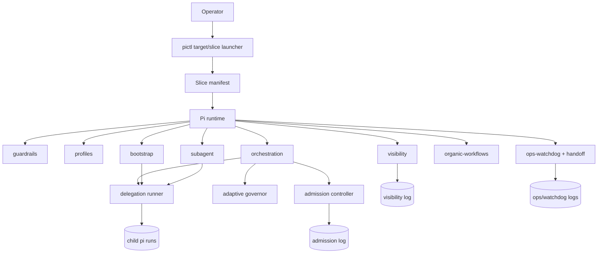
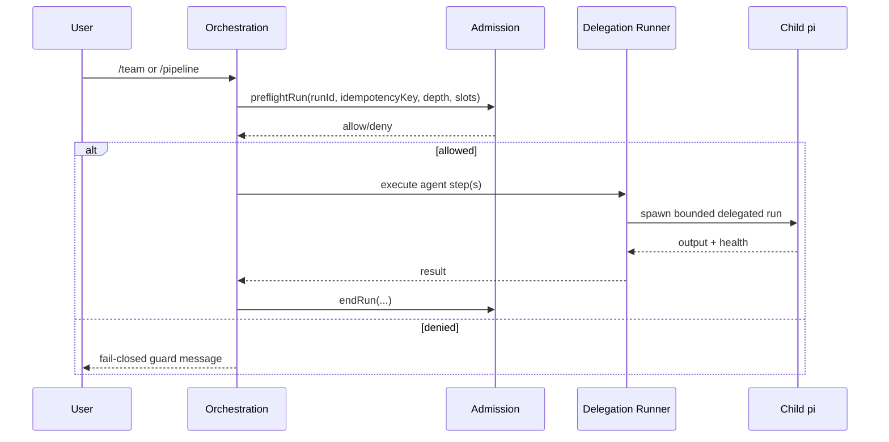

# Runtime Topology

Purpose: keep `pi-agent-config` understandable as it scales.

## Layered architecture

## Orchestration critical path

## Design rule

- Keep extension entrypoints thin.
- Move policy/logic to testable modules.
- Preserve one explicit control point per risk domain (admission, governor, health, logging).
