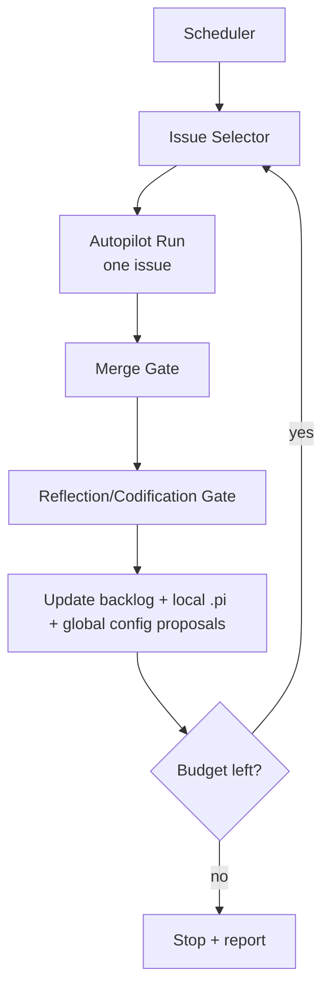

# Autonomous Autopilot Flywheel (seed spec)

## Objective

Run a bounded, unattended backlog-processing loop that can safely move issues from ready-state to merged-state, with a **mandatory reflection/codification phase** between runs.

## Why this exists

Per-issue autopilot is useful, but backlog velocity compounds when we can run overnight loops with strict controls and strong learning capture.

## System shape

## Required controls

- **Issue eligibility policy**
  - include labels: `autopilot/ready`, `autopilot/safe`
  - complexity cap labels: start with `size/xs` then `size/s`
  - risk filter: `risk/low`
  - exclude labels: `needs-product`, `needs-design`, `blocked`, `security-sensitive`
- **Budget policy**
  - max issues/run
  - max wall-clock runtime
  - max cost budget
  - max retries per issue
- **Escalation policy**
  - stop loop on repeated CI/review failures
  - stop loop on ambiguous requirements or dependency blockers
  - stop loop on budget exhaustion

## Reflection gate (mandatory)

Between each issue run, launch a high-intelligence reflection pass that answers:

1. What changed and why?
2. What did we learn about the repo/workflow?
3. What should be codified in:
   - repo-local `.pi/*`
   - global `pi-agent-config`
   - backlog priorities
4. What should be reverted/avoided next time?

### Output artifact

Write one reflection artifact per issue run, e.g.:

- `logs/flywheel/reflections/YYYY-MM-DD-issue-<n>.md`

Minimum sections:

- run summary
- confidence and risk
- codification proposals (local/global)
- backlog updates
- next-run policy adjustments

## Execution modes

### Stage 0 (safe pilot)

- one repo
- one issue/night
- only `size/xs`
- no auto-merge without explicit allowlist

### Stage 1 (controlled throughput)

- same repo
- up to two issues/night
- include `size/s`
- gated auto-merge allowed for selected labels

### Stage 2 (multi-repo)

- multiple repos with per-repo quotas
- staggered schedules
- central summary dashboard/report

## Suggested implementation split

1. **Flywheel runner** (new extension or SDK orchestrator)
   - deterministic state machine
   - persistent run ledger
2. **Issue selector module**
   - label/risk predicates
3. **Reflection module**
   - strict output contract
4. **Codification module**
   - safe auto-updates + escalation list
5. **Report module**
   - morning digest across repos

## Morning digest output (operator view)

- issues processed
- PRs opened/merged
- failures and blockers
- config updates proposed/applied
- budget usage
- confidence score

## Open questions

- Should reflection updates be auto-applied or always PR'd?
- Should merge remain human-authorized in Stage 1?
- Where to store cross-repo flywheel telemetry?
- Should this runner be extension-backed or external SDK/RPC daemon?
