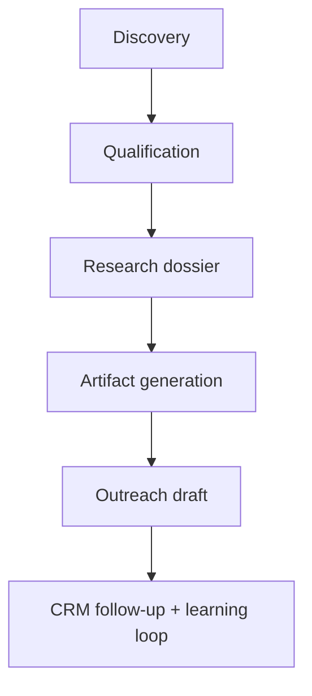

# SMB Prospecting + Outreach Flywheel (seed spec)

## Objective

Build a repeatable agent workflow that discovers small/medium businesses with high digital-upside potential, creates tailored outreach artifacts (site/software concepts), and supports respectful conversion-oriented outreach.

## Strategic concept

Instead of cold outreach with generic pitches, send high-signal value artifacts:

- "We built a targeted concept for your business"
- concrete before/after upside
- optional hosted demo (e.g. `<target>.mistystep.io`)

## Pipeline shape



## Lane definitions

### 1) Discovery lane

Find candidate businesses with signals such as:

- no website
- outdated/non-mobile site
- weak local search presence
- poor conversion flow

Outputs:

- normalized prospect record
- source provenance

### 2) Qualification lane

Score prospects on:

- likely business value from better web/software
- implementation feasibility
- contactability
- niche fit with your delivery strengths

Outputs:

- `score_total`
- `score_breakdown`
- go/no-go decision

### 3) Research dossier lane

Collect public context:

- services/offers
- brand tone and visible identity
- geographic and market context
- competition signals

Outputs:

- structured dossier markdown/json
- confidence + unknowns

### 4) Artifact generation lane

Generate one or more artifacts:

- polished single-page concept
- targeted service CTA flow
- optional domain-specific software concept mock

Outputs:

- build artifact(s)
- rationale tied to dossier

### 5) Outreach lane

Draft concise personalized outreach:

- link to artifact
- why it matters now
- low-friction next step

Outputs:

- email/DM variants
- follow-up sequence drafts

### 6) CRM lane

Track contact lifecycle + outcomes and feed learning back into scoring/routing.

## Suggested repository home

`misty-step` (or dedicated `prospecting-flywheel` repo), with:

- `prospects/` registry
- `dossiers/` generated profiles
- `artifacts/` generated demos
- `outreach/` templates + sent logs
- `scoring/` rubric definitions
- `runs/` automation run logs

## Minimal schema (v0)

```json
{
  "id": "prospect-2026-0001",
  "business_name": "Example Co",
  "location": "City, ST",
  "sources": ["..."],
  "website_status": "missing|weak|strong",
  "score_total": 78,
  "score_breakdown": {
    "value_upside": 30,
    "fit": 20,
    "reachability": 18,
    "speed_to_demo": 10
  },
  "status": "discovered|qualified|artifact-ready|contacted|responded|won|lost"
}
```

## Rollout plan

1. Manual pilot (10 prospects)
2. Semi-automated nightly discovery + qualification
3. Automated artifact drafting for top-ranked prospects
4. Controlled outreach automation with strict review gates

## Compliance + quality guardrails

- only use publicly available data
- avoid deceptive claims
- keep outreach respectful and low-frequency
- maintain opt-out handling
- enforce human review before broad sends (until validated)
